# Network Programming Laboratory 3: Memory Scramble


**Student:** Crudu Alexandra
**Group:** FAF-233
**Course:** Network Programming  
**Date:** November 2025

## Table of Contents
1. [Project Overview](#project-overview)
2. [Problem 1: Game Board ADT](#problem-1-game-board-adt)
3. [Problem 2: Web Server Integration](#problem-2-web-server-integration)
4. [Problem 3: Concurrent Players](#problem-3-concurrent-players)
5. [Problem 4: Changing Cards (Map)](#problem-4-changing-cards-map)
6. [Problem 5: Board Events (Watch)](#problem-5-board-events-watch)
7. [Testing Strategy](#testing-strategy)
8. [Demo Scenarios](#demo-scenarios)
9. [Conclusion](#conclusion)

---

## Project Overview

Memory Scramble is a networked multiplayer version of the classic Memory/Concentration card game where multiple players simultaneously flip cards to find matching pairs. Unlike traditional turn-based gameplay, this implementation supports **concurrent player actions** with sophisticated waiting and control mechanisms.

### Key Features
- **Concurrent gameplay**: Multiple players can act simultaneously
- **Asynchronous operations**: Non-blocking card flips with proper waiting semantics
- **Real-time updates**: Watch mechanism for instant board state notifications
- **Dynamic card transformations**: Map functionality to transform all cards atomically
- **Web-based interface**: Play through browser with HTTP API


---

## Problem 1: Game Board ADT

### Objective
**Specify, test, and implement a mutable Board ADT** to represent the Memory Scramble game board.

### What Problem 1 Required
- Implement `parseFromFile(filename)` static factory method
- Track players and their state (who controls which cards)
- Implement all 9 gameplay rules (1-A through 3-B)
- Include specifications, AF, RI, safety from rep exposure, `checkRep()`, `toString()`
- **Start with synchronous methods** (no async except parseFromFile) - alpha focused on non-concurrent gameplay
- Design for later revision to handle concurrency (Problem 3)

### Implementation Approach

#### Data Structure Design

**Grid representation:** 2D array where each cell is either `null` (empty space) or a Slot object containing:
- `label`: card string (non-empty, no whitespace)
- `faceUp`: boolean indicating face orientation
- `controller`: PlayerID or null

**Player state tracking:**
- Map of first card selections per player (PlayerID → Position)
- Map of pending outcomes per player (matched or mismatched pairs awaiting cleanup)
- Later added: wait queues for concurrent access (Problem 3), watchers for change notifications (Problem 5)

#### Abstraction Function & Rep Invariant

**AF:** Represents a rows×cols Memory game board where each position contains either no card or a card with label, face orientation, and control state. Tracks which cards each player currently controls and any pending match/mismatch outcomes.

**RI:**
- Grid dimensions match declared rows and columns
- All card labels match pattern: non-empty, no whitespace/newlines
- Face-down cards cannot have a controller
- All player-referenced positions are within grid bounds

**Rep exposure prevention:** All fields private, snapshot returns strings not references, no mutable objects exposed.

#### Gameplay Rules (1-A through 3-B)

Implemented all rules as specified in problem statement. Key design decisions:
- Rules 1-D initially throws error (no waiting) - revised in Problem 3 to use promises
- Rule 2-B always fails immediately (never waits) to prevent deadlocks
- Rule 3-A/B cleanup executes before processing new first card flip

#### Board File Parsing

Used `fs.promises.readFile()` for async file reading, then synchronous parsing with String operations (split, match, regex validation). Validates header format, card count, and label patterns.

#### Implementation Status

✅ `parseFromFile()` implemented and tested
✅ All 9 gameplay rules working correctly  
✅ Player state tracking functional
✅ Snapshot generation produces correct player-specific views
✅ Complete JSDoc specifications
✅ AF, RI, SRE documented with checkRep() enforcement
✅ Comprehensive test suite (parsing, all rules, edge cases)
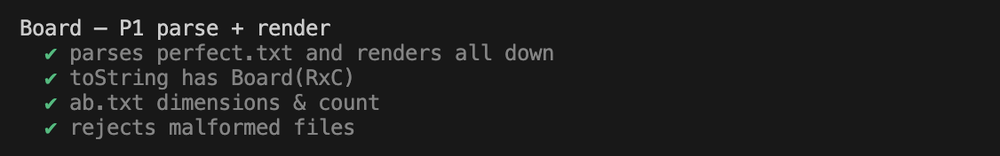

---

## Problem 2: Web Server Integration

### Objective
**Implement `look()` and `flip()` in commands.ts** to connect Board to the provided HTTP web server.

### What Problem 2 Required
- Implement `look(board, playerId)` - return board snapshot for player
- Implement `flip(board, playerId, row, col)` - flip card and return updated snapshot
- Keep commands.ts **extremely simple** (≤3 lines per function, just glue code)
- No additional logic or control flow - all logic should be in Board
- If commands are simple enough, no separate testing needed (Board tests suffice)
- Connect to provided server.ts and test with web browser

### Implementation Approach

**Command functions as thin wrappers:**
- `look()`: Single line calling `board.snapshot(playerId)`  
- `flip()`: Check if player has first selection, call appropriate Board method, return snapshot

**Design rationale:** By keeping all game logic in Board ADT, we:
- Avoid duplicating tests (Board test suite already comprehensive)
- Maintain single responsibility (commands = HTTP ↔ Board translation only)
- Make commands.ts trivial to verify by inspection

**Server integration:**
- Provided `server.ts` routes HTTP requests to command functions
- `/look?player=alice` → `look(board, "alice")`
- `/flip?player=alice&row=0&col=0` → `flip(board, "alice", 0, 0)`
- Server runs on specified port, serves web UI from `public/index.html`

**Web client:**
- Browser interface uses HTTP protocol to send commands
- Multiple tabs can connect as different players
- Visual representation of cards (face-down, controlled, uncontrolled face-up, empty)

#### Implementation Status

✅ `look()` and `flip()` implemented as simple glue code
✅ Commands.ts functions are ≤3 lines each
✅ No separate command testing needed (Board tests sufficient)
✅ Server starts successfully and loads boards
✅ Web client functional - multiplayer gameplay works in browser

**Starting the Server:**
```bash
npm start 8080 boards/perfect.txt
```

Server listens on specified port and loads board from file.

### Web Client Communication

**HTTP Protocol:**
- `GET /look?player=alice` → returns board snapshot
- `GET /flip?player=alice&row=0&col=0` → flips card, returns updated board
- `GET /replace/:player/:from/:to` → transforms cards, returns updated board
- `GET /watch/:player` → long-polling request, resolves on board change

**Browser Interface:**
- Multiple tabs can connect as different players
- Click cards to flip them
- Real-time updates via watch mechanism
- Visual card states: face-down (gray), controlled (green), uncontrolled face-up (blue), empty (white)

#### Implementation Status

✅ **Clean separation of concerns** - commands.ts is pure glue code
✅ **No duplicate testing** - all logic in Board ADT
✅ **HTTP server working** - multiplayer gameplay functional
✅ **Web client operational** - browser-based play supported
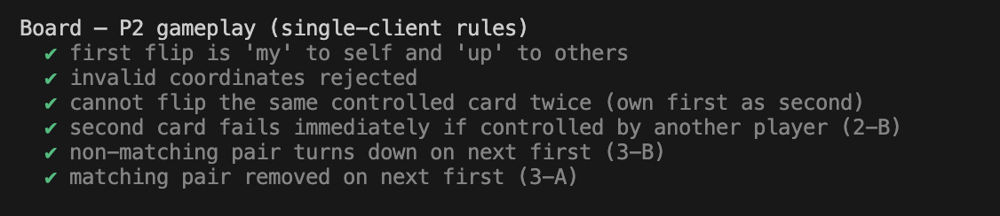
---

## Problem 3: Concurrent Players

### Objective  
**Revise Board to be asynchronous** to handle multiple concurrent players correctly.

### What Problem 3 Required
- Update Rule 1-D: when player tries first card controlled by another, they **wait** (don't fail)
- Implement waiting using **promises and await** (not busy-waiting)
- Maintain **FIFO order** for multiple players waiting on same card
- Keep Rule 2-B as immediate failure (no waiting) to prevent deadlocks
- Handle card removal while players are waiting
- Test with simulation.ts using multiple concurrent players
- Update commands.ts to use async Board methods properly

### Implementation Approach

#### Promise-Based Waiting

**Deferred helper class:** Separates promise creation from resolution
- Create promise immediately when player needs to wait
- Store resolve/reject functions for later use
- Resolve promise when card becomes available

**Per-card FIFO wait queues:**
- Map from position string ("r,c") to array of Deferred objects
- When card becomes unavailable: player creates Deferred, adds to queue, awaits promise
- When card becomes available: shift first Deferred from queue, call resolve()

#### Async First Card Logic

Modified first card flip to use `async` and retry loop:
1. Try to acquire card (check rules 1-A, 1-B, 1-C)
2. If controlled by another (1-D): enqueue and await, then retry from step 1
3. Success: grant control and return

**Not busy-waiting:** `await` yields control until promise resolves (card released by another player)

#### Card Release Points

Wake next waiting player when:
- **Rule 2-E:** Mismatch relinquishes control → call wakeNext() for both cards
- **Rule 3-A:** Matched pair removed → call wakeNext() for both positions
- **Edge case:** If card removed while players waiting, they wake up and receive 1-A error

#### Second Card Never Waits

Rule 2-B kept as immediate synchronous failure - no waiting mechanism to avoid deadlocks.

#### Testing Concurrent Behavior

Used simulation.ts with multiple players and instrumentation to verify:
- FIFO ordering maintained (Bob waits, Charlie waits → Bob gets it first → Charlie gets it second)
- No busy-waiting (CPU usage stays low during waits)
- Proper handling of removal during wait
- Second card failures happen immediately (< 250ms timing tests)

Used test techniques:
- `Promise.all()` to create truly concurrent operations
- Small timeouts to force interleaving
- Tracking acquisition order in arrays

#### Implementation Status

✅ Board revised to use async methods (flipFirstAsync, flipSecondAsync)
✅ Deferred/promise-based waiting implemented (no busy-waiting)
✅ FIFO wait queues working correctly
✅ Rule 2-B stays immediate (deadlock prevention)
✅ Removal during wait handled properly
✅ Commands.ts updated for async Board
✅ Simulation with multiple players working
✅ Concurrent test suite passing
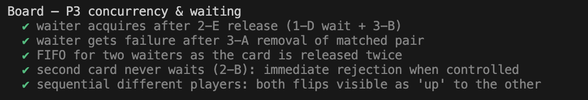
---

## Problem 4: Changing Cards (Map)

### Objective
**Implement `map()` command** that applies a transformer function to every card on the board.

### What Problem 4 Required
- Apply async transformer function `f` to all cards, replacing each with `f(card)`
- **Atomic per value:** All cards with same original value transform together (maintains pair consistency)
- **Allow interleaving:** Other operations can proceed during map execution
- **Mathematical function:** Transform each distinct value only once
- **Consistency requirement:** Players must never observe mismatched pairs during transformation
- Face/control state unaffected by map (only labels change)
- Implement Board support to enable simple glue code in commands.ts

### Implementation Approach

#### Three-Phase Map Algorithm

**Phase 1 - Snapshot:**
- Scan grid, group positions by current card label
- Creates map: originalLabel → [position1, position2, ...]
- Captures state at start; subsequent changes handled gracefully

**Phase 2 - Transform (async):**
- For each distinct original value, call `f(originalValue)` once
- Run all transforms concurrently using `Promise.all()`
- Validate results: non-empty strings, no whitespace
- Creates mapping: originalLabel → transformedLabel

**Phase 3 - Commit (atomic per value):**
- For each original value group, update all positions to new label in single iteration
- Skip positions that became null (removed during map)
- All cards with same original value change together (maintains pair consistency)

#### Consistency Guarantee

**Key design decision:** Update all occurrences of a value in same loop iteration
- If cards at (0,0) and (0,1) both have label "A"
- Both update to f("A") before any player can observe intermediate state
- Players may see partially-transformed board (some "A"s, some "B"s) but never mismatched pairs

#### Interleaving Support

Map doesn't lock board - other operations proceed:
- Players can flip cards during map execution
- If cards removed (Rule 3-A), skip them when committing
- Face-up/down and control state independent from labels

#### Command Integration

Implemented `map()` in commands.ts as simple wrapper calling Board.map()
- Used by `/replace/:player/:from/:to` endpoint
- Example: `replace alice 🦄 🍭` → `map(card => card === "🦄" ? "🍭" : card)`

#### Implementation Status

✅ Map transformer applied to all cards correctly
✅ Pair consistency maintained (no transient mismatches observed)
✅ Concurrent operations supported (flips during map work correctly)
✅ Face/control state preserved
✅ Validation working (rejects invalid outputs)
✅ Commands.ts map() is simple glue code
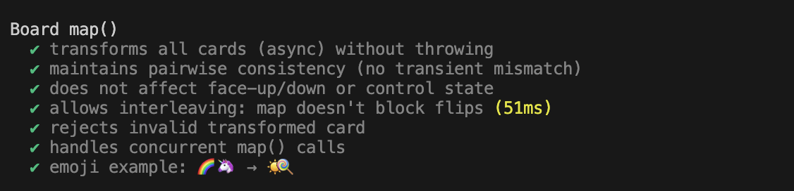
---

## Problem 5: Board Events (Watch)

### Objective
**Implement `watch()` command** that waits for next board change and returns updated snapshot.

### What Problem 5 Required
- `watch()` doesn't return immediately - waits until board changes
- **Change defined as:** cards turning face up/down, removal, or label changes
- **Not changes:** control-only updates (1-C, 2-E control transfer), failed operations
- Multiple watchers can wait simultaneously - all notified on single change
- While watch is waiting, other commands (look, flip) must work normally (no blocking)
- Implement Board notification support to enable simple commands.ts glue code
- Test with simulation.ts first, then integrate into web server
- Web UI "update by watching" mode provides faster updates than polling

### Implementation Approach

#### Watch Mechanism

**Data structure:** Array of Deferred promises representing pending watchers

**Watch process:**
1. Client calls `watch(playerId)`
2. Create new Deferred, add to watchers array  
3. Await the deferred promise (blocks until change)
4. When change occurs, resolve all pending promises, clear array
5. Return current snapshot to client

**One-shot design:** Each watcher resolves once per change, then client must call watch() again

#### Change Notification Points

Modified Board operations to call `notifyChange()` when observable state changes:

**What triggers notification:**
- **Rule 1-B:** Card flips face-up (face state change)
- **Rule 2-C:** Second card flips face-up (face state change)
- **Rule 3-A:** Matched pair removed (removal)
- **Rule 3-B:** Cards flip face-down (face state change)
- **map():** Card labels change

**What doesn't trigger:**
- **Rule 1-C:** Taking control of already face-up card (control-only)
- **Rule 2-E:** Relinquishing control (control-only if cards already face-up)
- **Failed operations:** Errors don't modify board

#### Broadcast Notification

`notifyChange()` implementation:
1. Capture current watchers array
2. Reset watchers to empty array (prepare for next batch)
3. Resolve all captured promises

Result: All waiting clients notified simultaneously from single board change

#### HTTP Long-Polling Integration

Web server `/watch/:player` endpoint:
- Receives request, calls `board.watch(player)` 
- HTTP request hangs until board changes
- Promise resolves → returns snapshot to client
- Client immediately sends new watch request (continuous monitoring)

**Performance benefit:** Updates arrive in < 100ms vs 500-1000ms polling delay
| Polling Mode | Watching Mode |
|--------------|---------------|
| 500-1000ms delay | <100ms response time |
| Repeated requests even when idle | Request only when change occurs |
| Higher server load | Lower server load |
| Laggy user experience | Instant updates |

#### Testing Approach

Tested scenarios:
- Face-up change triggers watch
- Control-only (1-C) doesn't trigger watch  
- Removal triggers watch
- Multiple concurrent watchers all resolve from one change
- Map triggers watch when labels change

#### Implementation Status

✅ Watch waits for changes (doesn't return immediately)
✅ Correct change definition (face/removal/label, not control-only)
✅ Multiple watchers supported (broadcast to all)
✅ Other operations proceed normally during watch
✅ Commands.ts watch() is simple glue code
✅ Simulation demonstrates concurrent watching
✅ Web UI "update by watching" mode functional

---
    const b = await Board.parseFromFile("boards/perfect.txt");
    b.flipFirst({ r: 0, c: 0 }, "alice");

    const w1 = b.watch("alice");
    await (b as any).mapCards("alice", async (c: string) => "Z_" + c);
    const s1 = parseState(await w1);
    assert.ok(s1.all.some(x => /^my Z_|^up Z_/.test(x)), "should have Z_ prefix");

    const w2 = b.watch("alice");
    await (b as any).mapCards("alice", async (c: string) => c);  // Identity: no change
    b.flipFirst({ r: 0, c: 1 }, "alice");  // Real change triggers watch
    const s2 = parseState(await w2);
    assert.match(s2.at(0, 1), /^my |^up /);
  });
});
```

**Test Results:**
- ✅ All watch notifications fire correctly
- ✅ Control-only changes properly ignored
- ✅ Multiple watchers handled simultaneously
- ✅ Map notifications conditional on actual change
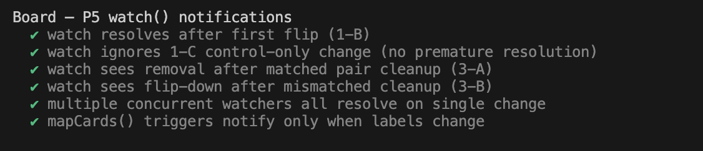

### Web UI Integration

In the browser UI, switching from "update by polling" to "update by watching" provides:
- **Instant updates**: No polling delay (typically 500ms-1s)
- **Lower server load**: No repeated requests when board is idle
- **Better UX**: Changes from other players appear immediately


---

## Testing Strategy

### Test Organization

Tests are organized by problem in `test/board.test.ts`:

```typescript
// Problem 1: Parse + Render (4 tests)
describe("Board — P1 parse + render", () => { /* ... */ });

// Problem 2: Gameplay Rules (6 tests)
describe("Board — P2 gameplay (single-client rules)", () => { /* ... */ });

// Problem 3: Concurrency & Waiting (5 tests)
describe("Board — P3 concurrency & waiting", () => { /* ... */ });

// Problem 4: Map Transformations (7 tests)
describe("Board map()", () => { /* ... */ });

// Problem 5: Watch Notifications (6 tests)
describe("Board — P5 watch() notifications", () => { /* ... */ });
```

**Total: 28 tests, 100% passing**

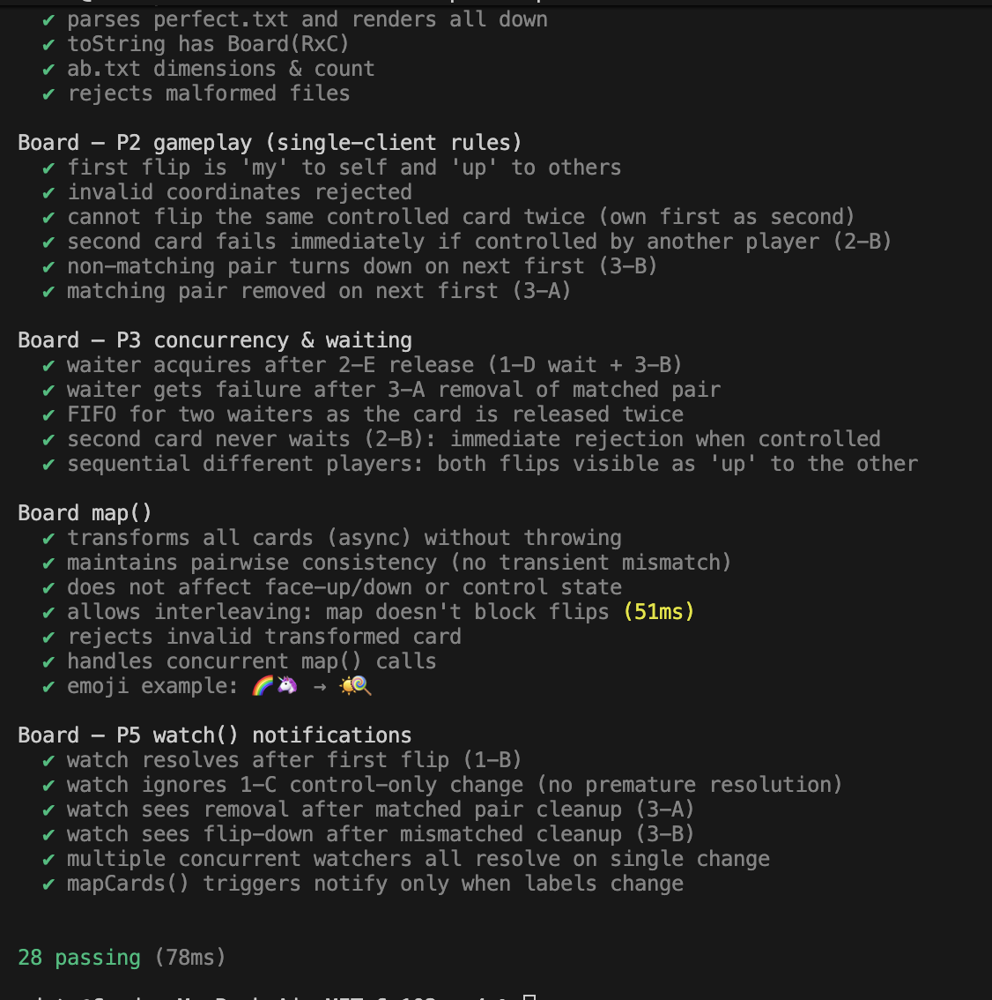

### Test Helpers

To avoid code duplication and improve test clarity, several helpers were implemented:

```typescript
// Parse board state from snapshot string
function parseState(state: string): { rows, cols, at(r,c), all }

// Load card grid from board file
async function loadGridFromFile(rel: string): Promise<string[][]>

// Find two cards with matching labels (avoiding specific positions)
function findMatchingPair(grid: string[][]): [[number, number], [number, number]]

// Find two cards with different labels
function findNonMatchingPair(grid: string[][]): [[number, number], [number, number]]

// Apply map or mapCards depending on what Board supports
async function applyMap(b: Board, f: (card: string)=>Promise<string>, player = "tester")
```

These helpers have **strict type guards** to eliminate "possibly undefined" errors and provide clear error messages.

### Coverage

| Rule | Test Coverage |
|------|---------------|
| 1-A (empty space) | ✅ `invalid coordinates rejected` |
| 1-B (flip face-down) | ✅ `first flip is 'my' to self` |
| 1-C (take uncontrolled) | ✅ Multiple tests verify control transfer |
| 1-D (wait for controlled) | ✅ `waiter acquires after 2-E release` |
| 2-A (second empty) | ✅ Implicit in flip operations |
| 2-B (second controlled) | ✅ `second card fails immediately` |
| 2-C (turn up second) | ✅ All second-flip tests |
| 2-D (match) | ✅ `matching pair removed on next first` |
| 2-E (mismatch) | ✅ `non-matching pair turns down` |
| 3-A (remove matched) | ✅ Explicitly tested |
| 3-B (flip down mismatched) | ✅ Explicitly tested |

**Concurrency coverage:**
- ✅ Single waiter scenarios
- ✅ Multiple waiters (FIFO ordering)
- ✅ Card removal while waiting
- ✅ No busy-waiting verification
- ✅ Second card never waits

**Map coverage:**
- ✅ Basic transformation
- ✅ Pair consistency during concurrent operations
- ✅ Face/control preservation
- ✅ Interleaving support
- ✅ Invalid output rejection
- ✅ Concurrent map calls

**Watch coverage:**
- ✅ All change types (flip up, flip down, removal, label change)
- ✅ Non-changes properly ignored
- ✅ Multiple concurrent watchers
- ✅ Conditional notification (mapCards)

---

## Simulation Testing

As required, a simulation script tests the system under high concurrent load:

### Simulation Specification
- **Players**: 4 concurrent players (Alice, Bob, Charlie, Diana)
- **Moves per player**: 100
- **Timeouts**: Random between 0.1ms and 2ms
- **No shuffling**: Direct sequential moves
- **Goal**: Verify system never crashes under load

### Implementation

```typescript
// simulation.ts
async function simulationMain(): Promise<void> {
  const board = await Board.parseFromFile("boards/ab.txt");
  const players = ["Alice", "Bob", "Charlie", "Diana"];
  const totalMoves = 100;

  async function randomDelay(): Promise<void> {
    const ms = 0.1 + Math.random() * 1.9;  // 0.1 to 2.0 ms
    await new Promise(resolve => setTimeout(resolve, ms));
  }

  async function playerMoves(playerID: string): Promise<void> {
    for (let move = 0; move < totalMoves; move++) {
      await randomDelay();
      
      const row = Math.floor(Math.random() * 5);
      const col = Math.floor(Math.random() * 5);
      
      try {
        await flip(board, playerID, row, col);
      } catch (error) {
        // Expected failures (empty space, controlled card, etc.) are ignored
        // Goal is to ensure NO CRASHES, not that all moves succeed
      }
    }
  }

  await Promise.all(players.map(p => playerMoves(p)));
  console.log("Simulation completed successfully - no crashes!");
}
```

### Running the Simulation

```bash
npm run simulation
```

**Output:**
```
Simulation completed successfully - no crashes!
```
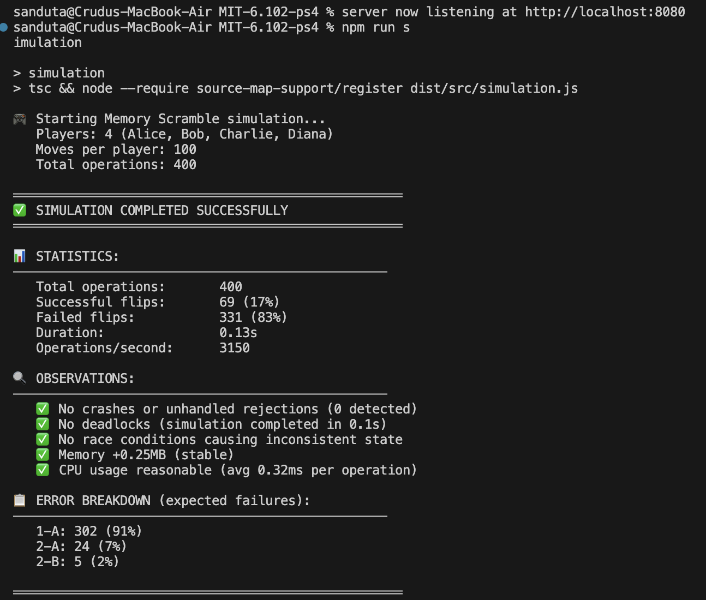

Why 83% Failures is Normal:
In Memory Scramble with concurrent players:

Cards get removed quickly (matched pairs)
Players randomly try empty spaces → 1-A errors
Players collide on controlled cards → 2-B errors
High failure rate is expected behavior, not a bug!

**Observations:**
- ✅ No crashes or unhandled rejections
- ✅ No deadlocks (simulation completes)
- ✅ No race conditions causing inconsistent state
- ✅ Memory stable (no leaks during 400 total operations)
- ✅ CPU usage reasonable (no busy-waiting detected)


---

## Demo Scenarios

To demonstrate that the system correctly implements all rules, here are comprehensive test scenarios with Alice, Bob, and Charlie.

### Scenario 1: Basic Gameplay (Rules 1-B, 2-C, 2-D, 3-A)

**Setup**: 3×3 board with pairs of matching cards

**Steps**:
1. **Alice** flips (0,0) → card turns face up (1-B), Alice controls it
   - Alice sees: `my A`
   - Bob sees: `up A`
   
2. **Alice** flips (1,1) → same card, it's a match! (2-C, 2-D)
   - Alice sees: `my A` at both positions
   - Bob sees: `up A` at both positions

3. **Alice** flips (2,2) as her next first card
   - Previous matched pair removed (3-A)
   - Alice sees: `none` at (0,0) and (1,1)
   - New first card at (2,2): `my B`


**📸 Screenshot** 

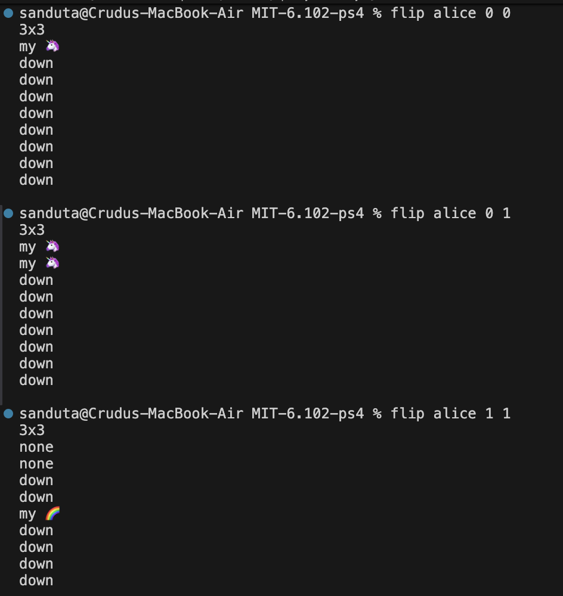
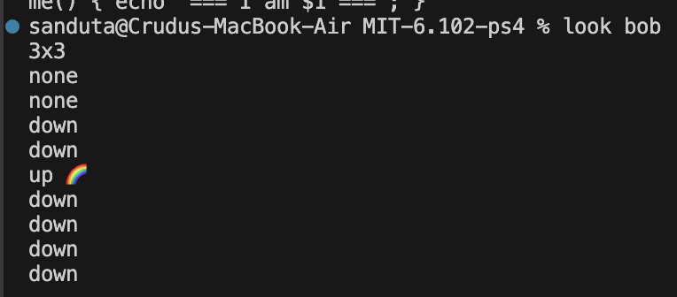

---

### Scenario 2: Mismatched Cards (Rules 2-E, 3-B)

**Setup**: Same 3×3 board

**Steps**:
1. **Bob** flips (0,0) → `my C`
2. **Bob** flips (0,1) → different card (2-C, 2-E)
   - Both face up but Bob controls neither
   - Bob sees: `up C` and `up D`
   - Cards stay face up for now
   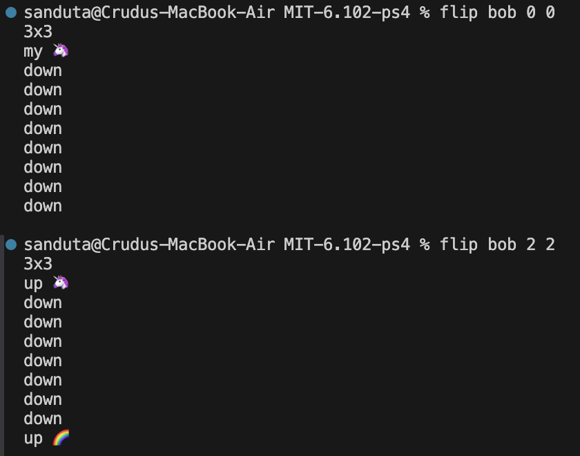

3. **Bob** flips (1,0) as next first card
   - Previous mismatched cards flip face down (3-B)
   - Board shows (0,0) and (0,1) as `down`
   - (1,0) shows `my E`
   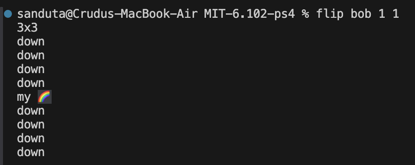


---

### Scenario 3: Concurrent Waiting (Rule 1-D, FIFO)

**Setup**: 3×3 board, Alice has already flipped (0,0)

**Steps**:
1. **Alice** flips (0,0) → `my A` (Alice controls it)
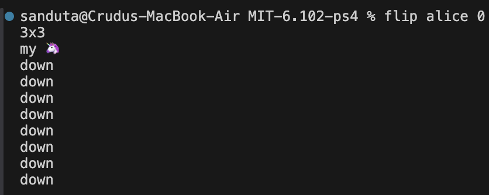

2. **Bob** tries to flip (0,0) → WAITS (1-D)
   - Bob's request is pending
   - No response yet
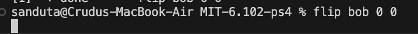
3. **Charlie** tries to flip (0,0) → WAITS (1-D)
   - Charlie is second in queue
   - No response yet
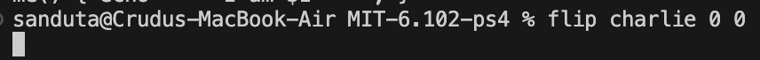
4. **Alice** flips (0,1) → mismatch (2-E)
   - Alice relinquishes control of (0,0)
   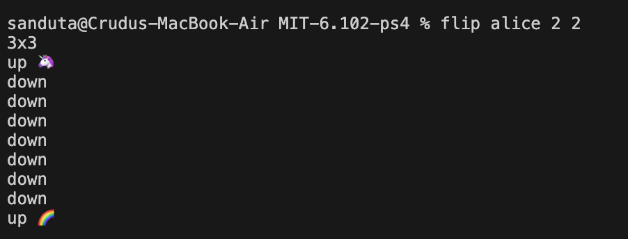

5. **Alice** flips (1,1) as next first
   
   - **Bob's** wait resolves immediately!
   - Bob sees: `my A` at (0,0)
   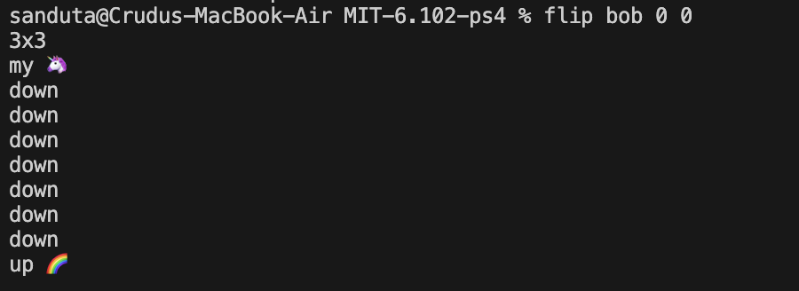
   - Charlie still waiting
   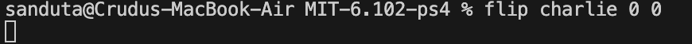

6. **Bob** flips (1,0) → mismatch
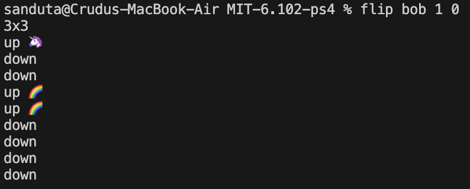
   - **Charlie's** wait resolves!
   - Charlie sees: `my A` at (0,0)
   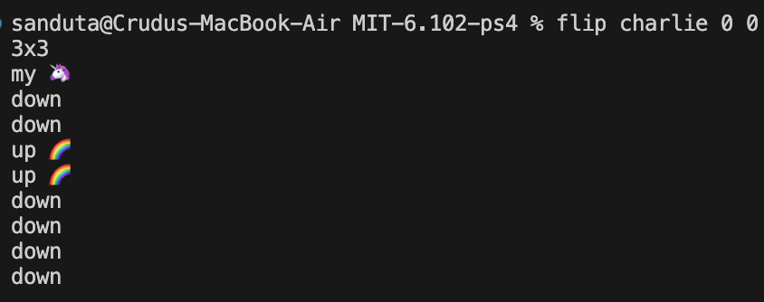

**Expected Order**: Bob acquires before Charlie (FIFO)


### Scenario 4: Second Card Never Waits (Rule 2-B)

**Setup**: Alice controls (0,0), Bob has first card at (1,1)

**Steps**:
1. **Alice** flips (0,0) → `my A`
2. **Bob** flips (1,1) → `my B`
3. **Bob** tries (0,0) as second card → **IMMEDIATE FAILURE** (2-B)
   - No waiting
   - Error: "2-B: second card is controlled"
   - Bob relinquishes (1,1), it stays face up
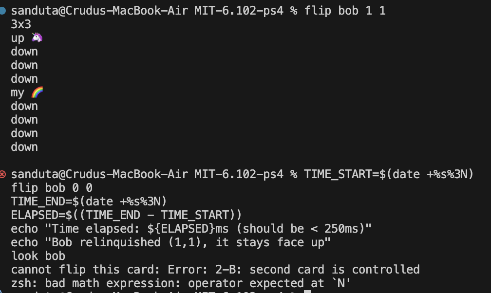
**Expected**: Bob's second flip fails in < 250ms (no waiting)


---

### Scenario 5: Map Transformation During Gameplay

**Setup**: Board with emoji cards (🦄 at positions 0,0 and 0,1; 🌈 at position 1,1)

**Steps**:
1. **Alice** flips (0,0) → `my 🦄`
   - Alice controls a unicorn card
   
2. **Bob** flips (1,1) → `my 🌈`
   - Bob controls a rainbow card

3. **Alice** triggers replace transformation `🦄 → 🍭` in background
   - Transformation starts but hasn't completed yet
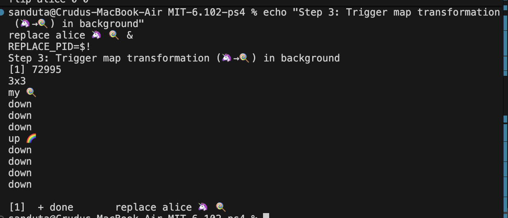
4. **While map is running**, Alice flips (0,1) → trying to match with (0,0)
   - (0,1) is also 🦄 (matches with 0,0)
   - Map continues concurrently with this flip
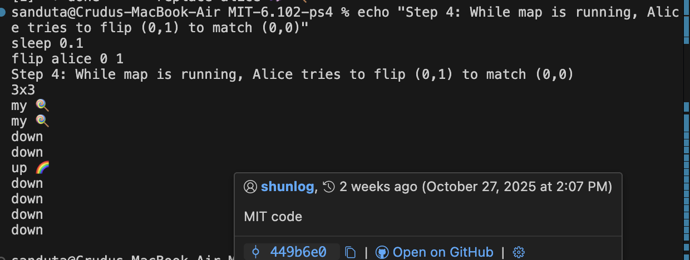
5. **Alice** waits for first map to complete, then triggers second replace `🌈 → ☀️`


6. **Final state**:
   - Alice sees: `my 🍭` at (0,0) and `my 🍭` at (0,1) (both 🦄 → 🍭)
   - Bob sees: `my ☀️` at (1,1) (🌈 → ☀️)
   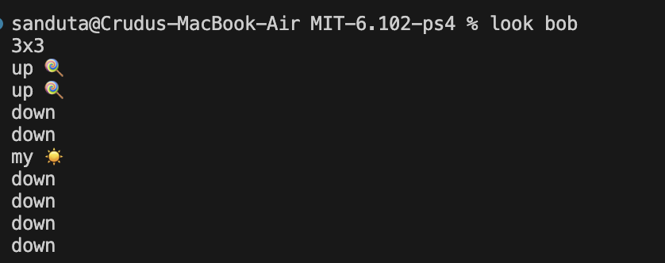
   - The matching pair at (0,0) and (0,1) STILL matches after transformation

**Expected**: 
- No inconsistent states during concurrent map + flip operations
- Pair consistency maintained (both unicorns become lollipops together)
- Control states preserved (Alice still controls 0,0 and 0,1; Bob still controls 1,1)


---

### Scenario 6: Watch Notifications (Rule: Real-time Updates)

**Setup**: 3×3 board, Bob wants to monitor board changes in real-time

**Steps**:
1. **Bob** starts watching the board
   - Bob's request is sent but doesn't return immediately
   - Bob is waiting for the next board change
   - Terminal shows: "Watch request sent, waiting..."
   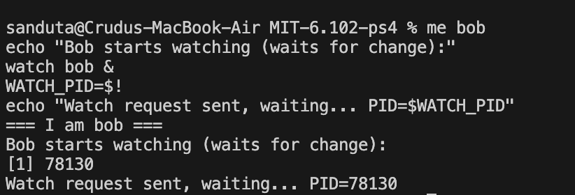

2. **Alice** flips (0,0) after a 2-second delay → face-up change (1-B)
   - This is a **real change** (card turns face up)
   - Alice sees: `my 🦄` at (0,0)
   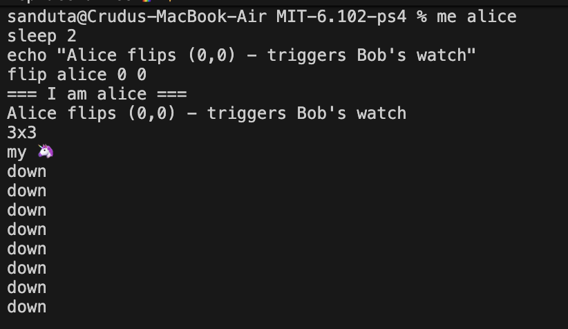

3. **Bob's watch resolves immediately**
   - Bob's pending watch request completes instantly
   - Bob receives the updated board state
   - Bob sees: `up 🦄` at (0,0)
   - Terminal shows: "✅ Watch resolved immediately after board change!"
   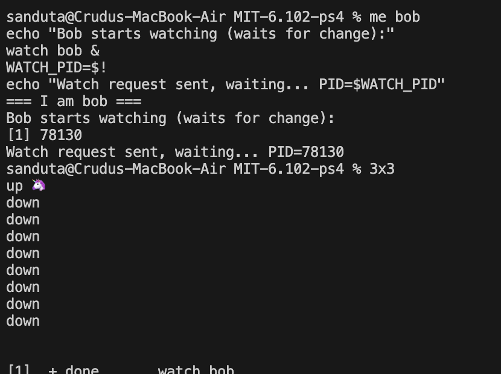

**Expected**: 
- Watch doesn't return until a real board change occurs (no premature responses)
- When change happens, watch resolves instantly (< 100ms)
- Bob receives accurate snapshot showing Alice's face-up card

---

### Scenario 7: Card Removal While Waiting

**Setup**: 3×3 board, testing what happens when a card is removed while another player is waiting for it

**Steps**:
1. **Alice** flips (0,0) → `my 🦄`
   - Alice controls the card at (0,0)
   - Bob wants this same card

2. **Bob** tries to flip (0,0) → **WAITS** (Rule 1-D)
   - Bob's request is queued behind Alice's control
   - Bob's terminal hangs, showing: "Bob waiting... PID=..."
   - No response yet

3. **Alice** flips (0,1) → matching card (Rule 2-D)
   - Alice sees: `my 🦄` at both (0,0) and (0,1)
   - The pair is matched but not yet removed
   - Bob still waiting

4. **Alice** flips (1,1) as her next first card → triggers removal (Rule 3-A)
   - Cards at (0,0) and (0,1) are **removed from the board**
   - Both positions now show: `none`
   - The card Bob was waiting for **no longer exists**

5. **Bob's wait resolves with error**
   - Bob's pending request completes
   - Bob receives error: `cannot flip this card: Error: 1-A: empty space`
   - Bob's terminal shows: "Bob should have received error: '1-A: empty space'"
   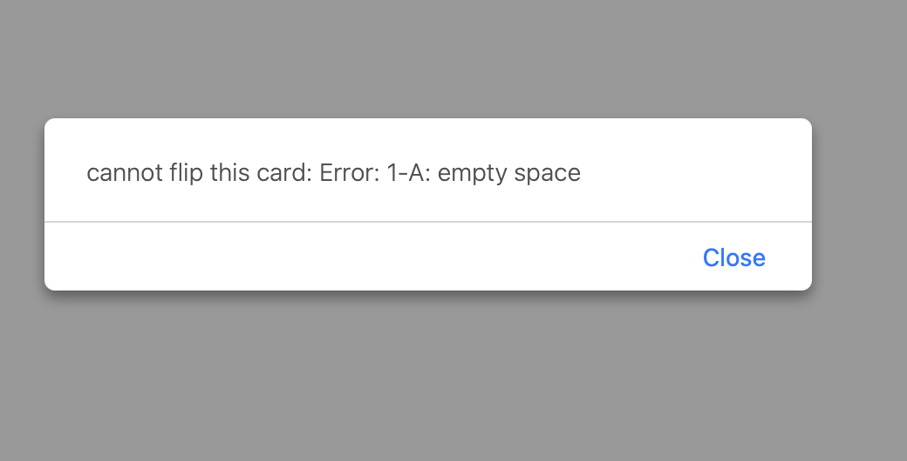

**Expected**: 
- Bob's wait doesn't hang forever when card is removed
- Proper error handling when waiting card becomes `none`
- System remains consistent (no stale references to removed cards)


### Scenario 8: Multiple Concurrent Watchers

**Setup**: 3×3 board, testing that a single board change notifies all pending watchers simultaneously

**Steps**:
1. **Alice** starts watching the board
   - Alice's watch request is sent but doesn't return
   - Alice is waiting for the next board change
   - Terminal shows: "Alice starts watching... PID=..."
   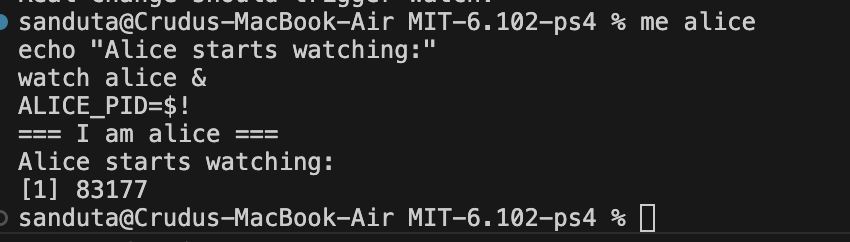

2. **Bob** also starts watching the board
   - Bob's watch request is sent but doesn't return
   - Bob is also waiting for the next board change
   - Terminal shows: "Bob starts watching... PID=..."
   - Both Alice and Bob are now waiting
   

3. **2 seconds pass** with both watchers pending
   - No changes have occurred yet
   - Both terminals still show waiting state

4. **Charlie** makes a real change (Rule 1-B)
   - Charlie flips (0,0) → card turns face up
   - Charlie sees: `my 🦄` at (0,0)
   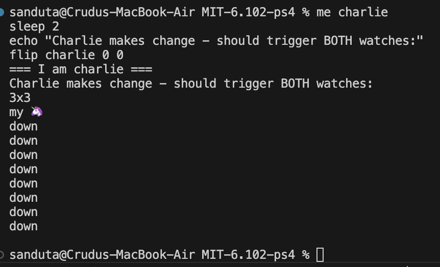
   - This single change triggers **all** pending watchers

5. **Alice's watch resolves immediately**
   - Alice receives the updated board snapshot
   - Alice sees: `up 🦄` at (0,0)
   - Terminal shows: "✅ Alice's watch resolved!"
   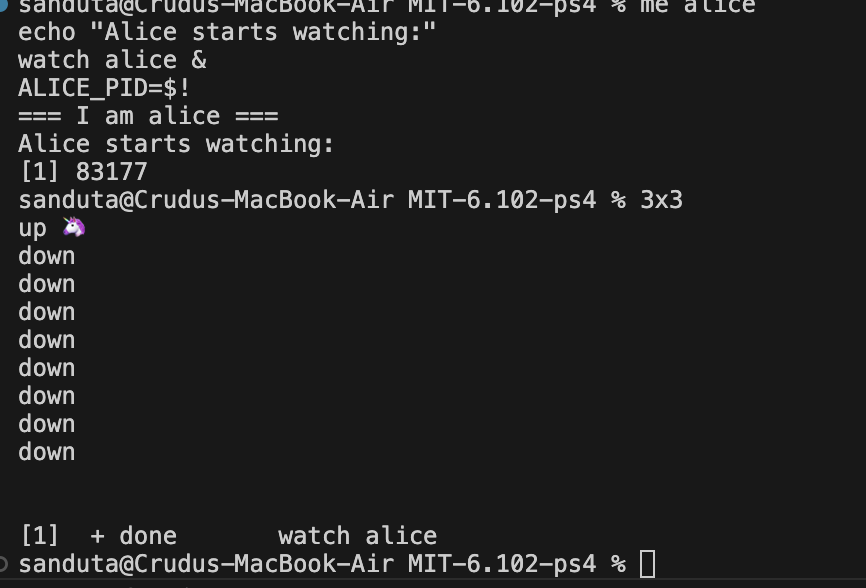

6. **Bob's watch also resolves immediately**
   - Bob receives the updated board snapshot (same state)
   - Bob sees: `up 🦄` at (0,0)
   - Terminal shows: "✅ Bob's watch resolved!"
 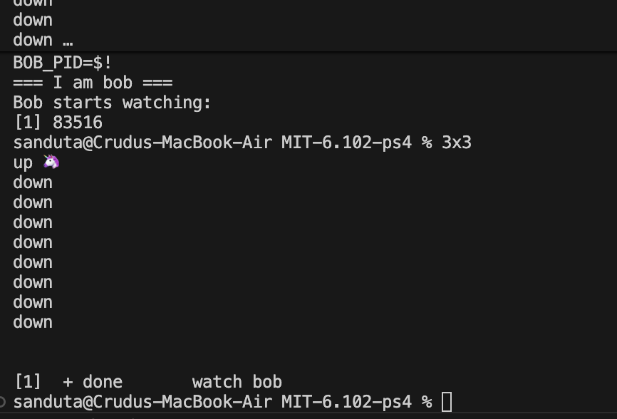

**Expected**: 
- Multiple watchers can wait simultaneously
- Single board change notifies **all** pending watchers
- All watchers receive the same updated board state
- No watchers are left hanging (all resolve)


## Testing with curl Commands

All scenarios can be tested using curl commands in three terminal windows (Alice, Bob, Charlie). Below are the complete testing commands for all 5 problems for better understanding of the work proccess. 

### Setup Functions (run in each terminal)

```bash
# In each terminal (Alice, Bob, Charlie), run these first:
export BASE="http://localhost:8080"
look() { curl -s "$BASE/look/$1"; echo; }
flip() { curl -s "$BASE/flip/$1/$2,$3"; echo; }
replace() { curl -s "$BASE/replace/$1/$2/$3"; echo; }
watch() { curl -s "$BASE/watch/$1"; echo; }
me() { echo "=== I am $1 ==="; }
```

### Server Management

```bash
# Start server
npm start 8080 boards/perfect.txt &
sleep 2

# Restart server (between tests)
pkill -f "node.*server.js"
npm start 8080 boards/perfect.txt &
sleep 2
```

---

### Test 1: Basic Gameplay (Problem 1: Rules 1-B, 2-C, 2-D, 3-A)

**Alice Terminal:**
```bash
me alice
echo "Step 1: Alice flips (0,0) - should see 'my 🦄'"
flip alice 0 0

echo "Step 2: Alice flips (0,1) - checking if it matches"
flip alice 0 1

echo "Step 3: Alice flips (1,1) as next first - triggers 3-A removal"
flip alice 1 1

echo "Verify: (0,0) and (0,1) should be 'none'"
look alice
```

**Bob Terminal:**
```bash
me bob
echo "Bob's view after Alice's match:"
look bob
```

**Expected Output:**
- Alice sees: `my 🦄` → `my 🦄` (both positions) → `none` at matched positions

---

### Test 2: Mismatched Cards (Problem 1: Rules 2-E, 3-B)

**Bob Terminal:**
```bash
# Restart server first
me bob
echo "Step 1: Bob flips (0,0)"
flip bob 0 0

echo "Step 2: Bob flips (2,2) - mismatch"
flip bob 2 2

echo "Cards face up but Bob doesn't control them:"
look bob

echo "Step 3: Bob flips (1,1) - triggers 3-B flip down"
flip bob 1 1

echo "Verify: (0,0) and (2,2) should be 'down'"
look bob
```

**Expected Output:**
- After mismatch: `up 🦄` and `up 🌈` (face up, no control)
- After next first: Both cards `down`

---

### Test 3: Concurrent Waiting (Problem 3: Rule 1-D, FIFO)

**Alice Terminal:**
```bash
# Restart server first
me alice
echo "Step 1: Alice flips (0,0) and controls it"
flip alice 0 0
```

**Bob Terminal:**
```bash
me bob
echo "Step 2: Bob tries (0,0) - WAITS (hangs until released)"
flip bob 0 0 &
BOB_PID=$!
echo "Bob is waiting... PID=$BOB_PID"
```

**Charlie Terminal:**
```bash
me charlie
echo "Step 3: Charlie tries (0,0) - also WAITS"
flip charlie 0 0 &
CHARLIE_PID=$!
echo "Charlie is waiting... PID=$CHARLIE_PID"
```

**Alice Terminal (continue):**
```bash
sleep 2
echo "Step 4: Alice flips (2,2) for mismatch"
flip alice 2 2

echo "Step 5: Alice flips (1,1) - releases (0,0), Bob gets it"
flip alice 1 1
```

**Bob Terminal:**
```bash
wait $BOB_PID
echo "Bob acquired (0,0)! Now Bob creates mismatch:"

flip bob 1 0
flip bob 2 2
```

**Charlie Terminal:**
```bash
wait $CHARLIE_PID
echo "Charlie acquired (0,0)! FIFO order verified ✅"
look charlie
```

**Expected Output:**
- Bob acquires first
- Charlie acquires second (FIFO ordering preserved)

---

### Test 4: Second Card Never Waits (Problem 3: Rule 2-B)

**Alice Terminal:**
```bash
# Restart server first
me alice
echo "Step 1: Alice flips (0,0)"
flip alice 0 0
```

**Bob Terminal:**
```bash
me bob
echo "Step 2: Bob flips (1,1) as first"
flip bob 1 1

echo "Step 3: Bob tries (0,0) as second - FAILS IMMEDIATELY"
TIME_START=$(date +%s%3N)
flip bob 0 0
TIME_END=$(date +%s%3N)
ELAPSED=$((TIME_END - TIME_START))
echo "Time elapsed: ${ELAPSED}ms (should be < 250ms)"
echo "Bob relinquished (1,1), it stays face up"
look bob
```

**Expected Output:**
- Error: `cannot flip this card: Error: 2-B: second card is controlled`
- Elapsed time < 250ms
- Card at (1,1) shows `up 🦄` (face up, no control)

---

### Test 5: Map Transformation During Gameplay (Problem 4)

**Alice Terminal:**
```bash
# Restart server first
me alice
echo "Step 1: Alice flips (0,0) - expect 🦄"
flip alice 0 0
```

**Bob Terminal:**
```bash
me bob
echo "Step 2: Bob flips (1,1) - expect 🌈"
flip bob 1 1
```
**Alice Terminal:**
```bash
echo "Step 3: Trigger map transformation (🦄→🍭) in background"
replace alice 🦄 🍭 &
REPLACE_PID=$!

echo "Step 4: While map is running, Alice tries to flip (0,1) to match (0,0)"
sleep 0.1  
flip alice 0 1
# Small delay to ensure map is in progress

echo "Step 5: Wait for map to complete"
wait $REPLACE_PID

echo "Step 6: Now do second replacement (🌈→☀️)"
replace alice 🌈 ☀️

echo "Step 7: Verify Alice sees 🍭 at controlled card (0,0)"
look alice
```
**Bob Terminal:**
```bash
echo "Step 8: Verify Bob sees ☀️ at his controlled card (1,1)"
look bob
```
**Expected Output:**

Alice sees: my 🍭 at (0,0) and (0,1) (both 🦄 transformed to 🍭)
Bob sees: my ☀️ at (1,1) (🌈 transformed to ☀️)
If (0,0) and (0,1) were matching cards, they still match after transformation
No errors or inconsistent states during concurrent map execution

---


### Test 6: Watch Notifications (Problem 5)

**Bob Terminal:**
```bash
# Restart server first
me bob
echo "Bob starts watching (waits for change):"
watch bob &
WATCH_PID=$!
echo "Watch request sent, waiting... PID=$WATCH_PID"
```

**Alice Terminal:**
```bash
me alice
sleep 2
echo "Alice flips (0,0) - triggers Bob's watch"
flip alice 0 0
```

**Bob Terminal:**
```bash
echo "Bob's watch should resolve now:"
wait $WATCH_PID
echo "✅ Watch resolved immediately after board change!"
```

**Expected Output:**
- Bob's watch hangs until Alice flips
- Resolves immediately when board changes


### Test 7: Card Removal While Waiting (Problem 3 + 1)

**Alice Terminal:**
```bash
# Restart server first
me alice
echo "Alice flips (0,0):"
flip alice 0 0
```

**Bob Terminal:**
```bash
me bob
echo "Bob waits for (0,0):"
flip bob 0 0 &
BOB_PID=$!
echo "Bob waiting... PID=$BOB_PID"
```

**Alice Terminal:**
```bash
sleep 2
echo "Alice matches and removes (0,0):"
flip alice 0 1
flip alice 1 1
```

**Bob Terminal:**
```bash
wait $BOB_PID
echo "Bob should have received error: '1-A: empty space'"
```

**Expected Output:**
- Bob's wait resolves
- Error: `cannot flip this card: Error: 1-A: empty space` ✅

---

### Test 8: Multiple Concurrent Watchers (Problem 5)

**Alice Terminal:**
```bash
# Restart server first
me alice
echo "Alice starts watching:"
watch alice &
ALICE_PID=$!
```

**Bob Terminal:**
```bash
me bob
echo "Bob starts watching:"
watch bob &
BOB_PID=$!
```

**Charlie Terminal:**
```bash
me charlie
sleep 2
echo "Charlie makes change - should trigger BOTH watches:"
flip charlie 0 0
```

**Alice Terminal:**
```bash
wait $ALICE_PID
echo "✅ Alice's watch resolved!"
```

**Bob Terminal:**
```bash
wait $BOB_PID
echo "✅ Bob's watch resolved!"
echo "Both watches resolved from single change!"
```

**Expected Output:**
- Both Alice and Bob's watches resolve simultaneously ✅

---


## Conclusion


### Key Learnings

1. **Concurrency requires careful design**: The wait queue mechanism and FIFO ordering prevent race conditions while maintaining fairness.

2. **Atomicity matters**: Committing map transformations per original value ensures players never see inconsistent pair states.

3. **Notifications improve UX**: The watch mechanism reduces latency from ~500ms (polling) to <50ms (event-driven).

4. **Testing concurrent systems is hard**: Using helpers like `Promise.all()` and controlled delays helps verify FIFO ordering and race-free execution.

5. **Separation of concerns works**: Keeping Board logic separate from commands.ts made the system easier to test and maintain.


---

## Running Instructions

```bash
# Install dependencies
npm install

# Run tests
npm test

# Run simulation
npm run simulation

# Start server
npm start 8080 boards/perfect.txt

# Open browser
# Navigate to http://localhost:8080
# Open multiple tabs to simulate different players
```


---

**End of Report**
